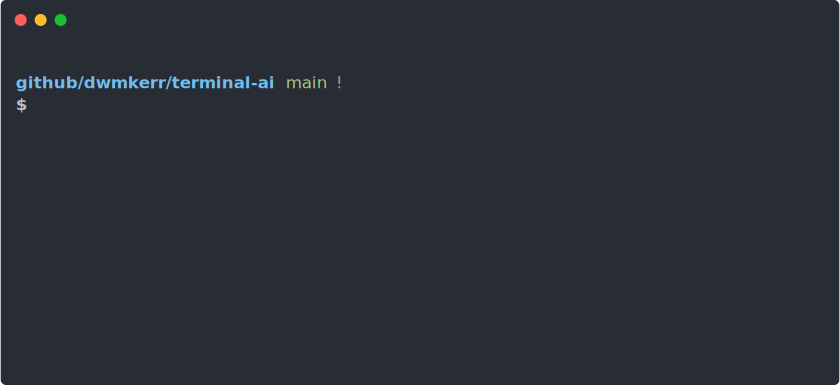
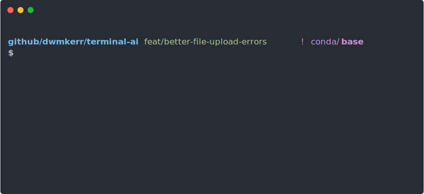

<p align="center">
  <h2 align="center"><code>🧠 terminal-ai</code></h2>
      <h3 align="center">Effortless AI in the shell. Maintain your flow and be more effective.</h3>
  <p align="center">
      
  </p>
  <p align="center">
    <a href="#quickstart">Quickstart</a> |
    <a href="#examples">Examples</a> |
    <a href="#actions">Actions</a> |
    <a href="#commands">Commands</a> |
    <a href="#configuration">Configuration</a> |
    <a href="#api-key">API Key</a> |
    <a href="#experimental">Experimental</a> |
    <a href="#developer-guide">Developer Guide</a>
  </p>
  <p align="center">
    <a href="https://github.com/dwmkerr/terminal-ai/actions/workflows/cicd.yaml"></a>
    <a href="https://www.npmjs.com/package/@dwmkerr/terminal-ai"></a>
    <a href="https://codecov.io/gh/dwmkerr/terminal-ai"></a>
  </p>
</p>

## Quickstart

Install Terminal AI:

```bash
npm install @dwmkerr/terminal-ai
```

Run the tool to configure your environment and start interactively interfacing with AI:

```bash
ai
```

That's it. The quickest way to learn how to use the tool is to look at the [Examples](#examples).

> [!TIP]
> Terminal AI requires an API key to be configured. Get a free API by following the guide [here](#api-key) 💪. If you need to change your configuration, run `ai init` or check the [Configuration Documentation](./docs/configuration.md).

## Examples

Quick links:

- [Setup](#setup)
- [Simple Chat](#simple-chat)
- [Multiline Input](#multiline-input)
- [Copying to the Clipboard or Saving to a File](#copying-to-the-clipboard-or-saving-to-a-file)
- [Attaching Files](#attaching-files)
- [Writing Code](#writing-code)
- [Executing Scripts](#executing-scripts)
- [Piping Input](#piping-input)
- [Adding a New Provider](#adding-a-new-provider)
- [Advanced](#advanced)

### Setup

Setup your initial configuration with:

```bash
ai init
```

This will allow you to enter your API key and configure your provider.


To update your configuration or add additional providers, run `ai init` again. You can also check the [Configuration Documentation](./docs/configuration.md).

### Simple Chat

To chat, run `ai` and follow the prompts. If you press 'Enter' in the chat prompt instead of replying then the actions menu will pop up with more options:


To execute a chat command, pass your message as a parameter. Note that you should always separate the message parameter from any other flags or commands by using the `--` separator:

```
ai -- "How can I programatically create a calendar invite?"
```

If `ai` detects that you are using a TTY then it will prompt you to continue the conversation. If you are not, the message will be responded to and the tool will close:

```
ai -- "How can I programatically create a calendar invite?" > answer.txt
```

### Multiline Input

To provide multiline input (or paste multiple lines input input) you can use the Actions Menu to select the 'Chat (Multiline)' action. Just press <code>Enter</code> at the prompt. Your `$EDITOR` will open:



### Attaching Files

Attach file to the chat with the `-f` or `--file` parameter:

```bash
ai -f package.json -f package-lock.json -- "what's my package version and most complex transitive dependency?"
```



### Copying to the Clipboard or Saving to a File

Open the Actions menu with 'Enter' and choose 'Copy Response'. The most recent message will be copied. To save a file, use the 'Save Response' action.

You can copy to the clipboard by specifying the `-c` or `--copy` parameter:

```bash
ai -c -- "Travel time for London to Paris?"
```

You can also copy to the clipboard by piping to a program like `pbcopy`. This example uses the `code` intent to ask for code output only and writes to the clipboard:

```bash
ai -- "code: bash script to zip all files in current directory" | pbcopy
```

### Writing Code

If you want a response to only contain code, prefix your message with `code:`. This makes it much easier to create a response which is ready to be pasted into a file or saved and executed:


To run as a command:

```bash
ai -- "code: Python code to find largest file in current directory" > findfile.py
```

The `code` output intent tries to ensure that a _single_ code block is created, rather than multiple blocks in multiple languages. It does this by asking for a single listing with comments used to indicate whether other scripts or operations are needed.

### Executing Scripts

You can execute scripts by asking for `code` output, pressing 'Enter' in the response prompt to open the Actions menu and then choosing 'Execute Response'. Terminal AI will ask you to verify the code (using your configured `$EDITOR`) and then ask for confirmation before executing:


### Piping Input

You can pipe content to `ai` - in this example the current uncommitted changes in a repo are analysed:


Tips:

- You must provide a prompt, e.g: `git diff | ai -- 'do I have enough tests?`
- You can also pipe the results, e.g: `gif diff | ai -- 'write a git patch that adds tests' > tests.patch`
- You can refer to the input with the file name `stdin`, e.g: `ai -- 'how many words in stdin?' < dictionary.txt`

### Adding a New Provider

To add a new provider (or edit an existing one) just run `ai init`:


Tips:

- Suggested models and descriptions are loaded from [`ai-providers-and-models`](https://github.com/dwmkerr/ai-providers-and-models)

### Advanced

Advanced or experimental features.

Force color output (useful if you are piping and need color codes):

```bash
# Force color output:
# - set FORCE_COLOR=1
# - ascii formatting will be applied even if stdout is not a tty
# - use 'less -r' (-r = raw, render color codes) as a way to quickly test.
FORCE_COLOR=1 ai 'show me some markdown features' | less -r
```

Example of how to interactively stage, generate a conventional commit:

- [`aigac.sh`](./docs/casts/aigac.sh) - AI Git Add Commit shell script

<a href="./docs/casts/aigac.svg"></a>

## Actions

When you press `Enter` in the chat prompt, the Actions menu will pop up. These actions offer additional features to work with AI.

### Change Model

The 'Change Model' action allows you to change the model that is in use:


Models which have been extensively tested and verified to work with Terminal AI are shown in the list first, along with a short description of the model and its capabilities. Models which are offered by AI APIs but have not been extensively tested are shown next.

You can also provide the ID of any model that is _not_ in the list by changing the `model` setting in the [Configuration](#configuration).

Verified models are provided by the [`ai-providers-and-models`](https://github.com/dwmkerr/ai-providers-and-models) project.

## Commands

**`ai`**

The default `ai` command initiates a chat. Simply run `ai`:

```bash
ai
```

You can provide the initial message as a parameter to the tool:

```bash
ai -- "How do I install NodeJS?"
```

The following parameters are available:

| Parameter              | Description                                                             |
|------------------------|-------------------------------------------------------------------------|
| `-c, --copy`           | Copy response to the clipboard and exit.                                |
| `-r, --raw`            | Do not format markdown or change the response in any way.               |
| `-f, --file <path>`    | (Multiple allowed). Attach file to the chat.                            |
| `--assistant`          | (Experimental). Use the Assistants API rather than the Completions API. |
| `--no-context-prompts` | Disable context prompts (e.g. 'my shell is bash').                      |
| `--no-output-prompts`  | Disable output prompts (e.g. 'show code only').                         |

**`ai init`**

The `ai init` commands allows you to initialise or update your configuration (such as your API key). It also offers the option to validate your configuration:

```
$ ai init

Welcome to Terminal AI

An OpenAI or compatible key is required.
To get a free key follow the guide at:
  https://github.com/dwmkerr/terminal-ai#api-key

✔ Your API key provider: Gemini (OpenAI Compatible)
✔ API Key: ******
...
```

This command also allows advanced configuration such as the model to be updated.

**`ai check`**

The `ai check` command validates your configuration, ensuring your OpenAI API key is configured correctly:

```
$ ai check

✔ Checking internet connection...
✔ Checking Base URL https://generativelanguage.googleapis.com/v1beta/openai/...
✔ Checking API key...
✔ Checking Model models/gemini-2.0-flash...
✔ Checking API key rate limit...
...
```

**`ai config`**

Shows the current configuration, which is loaded from the configuration files in the [`~/.ai`] folder, environment variables and the `prompts` folder.

**`ai config edit`**

Open the configuration file `~/.ai/config.yaml` in `$EDITOR`.

### Error Codes

All error codes are documented at [`src/lib/errors.ts`](./src/lib/errors.ts).

## API Key

To make calls to an AI provider such as OpenAI, you will need an API key. If you have an API key, simply run `ai init` and follow the instructions.

If you do not have an API key you can use a provider such as Google Gemini, which allows you to create a key for free and without a credit card.

To get a free API key, go to https://ai.google.dev/gemini-api/docs/api-key and choose "Get a Gemini API Key" and then "Create API Key":

<image alt="Screenshot of Create API Key" src="./docs/images/gemini-api-key.png" width="120px" />

Save this key to a safe location. Then run `ai init` and follow the instructions - be sure to choose `Gemini (OpenAI Compatible)` as the provider in the first step:

```
Welcome to Terminal AI

An OpenAI or compatible key is required.
To get a free key follow the guide at:
  https://github.com/dwmkerr/terminal-ai#api-key

✔ Your API key provider: Gemini (OpenAI Compatible)
✔ API Key: ******
? Test API Key & Configuration? (y/N)
```

You can configure multiple providers and update your configuration by running `ai init` at any time. Check the [Reference Configuration Documentation](./docs/configuration.md#reference-configuration) for more information and examples of how to configure common providers.

## Configuration

Configuration is loaded from the `~/.ai/config.yaml` file. Specific parameters can also be set or overridden using Environment Variables.

You can set up your configuration interactively by running `ai init`. You can test all of the configuration parameters you have set with `ai check` - this will verify your API key, rate limits, the configured model and more.

Detailed in instructions for how to configure `ai` are in the [Configuration Documentation](./docs/configuration.md).

If you want to run `ai` without interactively initialising first (for example, in a CI/CD environment or when using a GitHub action such as [`terminal-ai-action`](https://github.com/dwmkerr/terminal-ai-action)) you can create this configuration file yourself. If you can only specify an API key in your configuration, `ai` will assume you are using OpenAI. This means if you have an OpenAI key you can simply do this:

```yaml
apiKey: <Your Key>                    # Required.
baseURL: "https://api.openai.com/v1/" # Optional.
model: "gpt-3.5-turbo"                # Optional.
```

Or you can set the `AI_API_KEY` environment variable:

```bash
export AI_API_KEY="<your key"                   # Required.
export AI_BASE_URL="https://api.openai.com/v1/" # Optional.
export AI_MODEL="gpt-3.5-turbo"                 # Optional.
```

To configure multiple providers or advanced options, check the [Configuration Documentation](./docs/configuration.md).

## Experimental

**Assistants API**

You can try using the [Assistants APIs](https://platform.openai.com/docs/assistants/overview) rather than the [Completions APIs](https://platform.openai.com/docs/guides/completions) with the `--assistant` flag:

```bash
ai --assistant -- "Who are you?"
```

Note that responses will be considerably slower and more API calls will be made.

## Developer Guide

Clone the repo, install dependencies, build and then run:

```bash
git clone git@github.com:dwmkerr/boxes.git

# optional: use the latest node with:
# nvm use --lts
npm install
npm start

# If 'actionlint' is installed, the GitHub workflows will be linted.
brew install actionlint
```

If you want to install the `ai` command run the following:

```bash
npm run build # or 'npm run build:watch' to live rebuild...
npm install -g .

# Now run ai commands such as:
ai "ask me anything" # run 'ai' again if the build has updated...

# Clean up when you are done...
npm uninstall -g .
```

### Debugging

The [`debug`](https://github.com/debug-js/debug) library is used to make it easy to provide debug level output. Debug logging to the console can be enabled with:

```bash
AI_DEBUG_ENABLE="1" npm start
```

The debug namespaces can be configured like so:

```bash
AI_DEBUG_NAMESPACE='ai*'
```

### Testing

The following commands are helpful when testing:

```bash
# Run all tests. Run tests with coverage.
npm run test
npm run test:cov

# Run (or watch, or debug) tests that match a pattern.
npm run test -- theme
npm run test:watch -- theme
npm run test:debug -- theme
```

### Terminal Recording / asciinema

To create a terminal recording for the documentation:

- Install [asciinema](https://asciinema.org/) `brew install asciinema`
- Check that you have your profiles setup as documented in `./scripts/record-demo.sh`
- Run the script to start a 'clean' terminal `./scripts/record-demo.sh`
- Download your recording, e.g. to `./docs/620124.cast`
- Install [svg-term-cli](https://github.com/marionebl/svg-term-cli) `npm install -g svg-term-cli`
- Convert to SVG: `./scripts/demo-to-svg.sh`

### Concepts

**Actions** - these are commander.js functions that are called by the CLI. They should validate/decode parameters and ask for missing parameters. They will then call a **command**.
**Commands** - these are the underlying APIs that the CLI offers - they are agnostic of the command line interface (and could therefore be exposed in a web server or so on).
**Context** - information which is provided via prompts to shape the intended output. More details below.

### Context

"Context" refers to prompts which are passed to the model before the user interacts, which can provide the model with more information about the environment of the user or their potential intent. Examples would be:

- That the user is running in a shell, with a given set of terminal dimensions
- What the operating system is that the user is running
- (WIP) the organisation and name of the local Git repo
- (WIP) the primary language of the current Git repo.

### Context Prompts

When expanding context prompts (e.g. ./prompts/chat/context/context.txt) environment variables may be used to give more specific information. As well as those provided by the system (or yourself), the following are automatically set for convenience:

| Environment Variable | Description                            |
|----------------------|----------------------------------------|
| `OS_PLATFORM`        | `nodejs os.platform()`                 |
| `TTY_WIDTH`          | The terminal width (or 80 if not set)  |
| `TTY_HEIGHT`         | The terminal height (or 24 if not set) |
